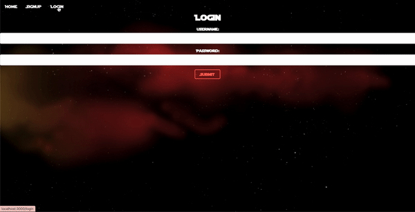
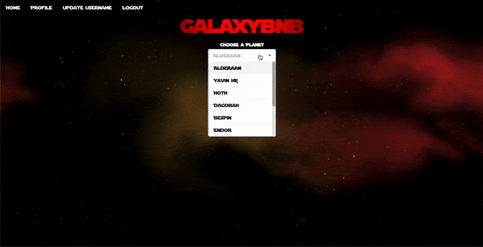
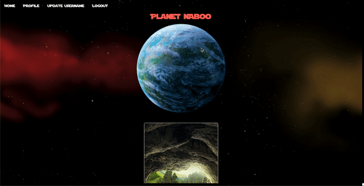
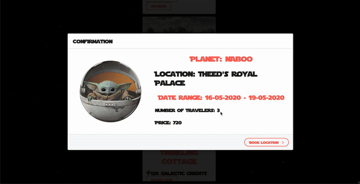
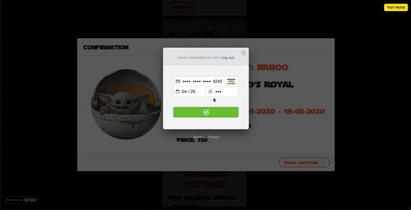

<h1 align="center">Galaxybnb 🪐</h1>

A `React` application that allows users to book vacations on different Star Wars planets!🚀

## Technologies
This web app makes use of the following technologies:

## Backend
* Ruby [2.6.1]
* Rails [~> 6.0.2, >= 6.0.2.1] - MVC web framework used as an API
* SWAPI (Star Wars API)
* Stripe API
* Dotenv - Rails gem for securing API Keys
* Bcrypt [~> 3.1.7] - Encrypt and secure user passwords
* Rack-cors - Handles Cross-Origin Resource Sharing (CORS), which makes cross-origin AJAX possible
* JWT [~> 2.2] - Cryptographic signing
* PostgreSQL [>= 0.18, < 2.0] - Database

## Frontend 
* React.js
* React Router - implemented for delcaritive routing
* Semantic UI React
* Customized CSS3 styling
* Stripe API

## Prerequistes
Before you continue, please make sure you have installed the latest version of:

* Ruby
* Ruby on Rails
* PostgreSQL
* React

## Launch
To launch this application, you'll have to follow these steps:

## Backend Installation
* Clone [this repo](https://github.com/rlc900/galaxybnb_backend_api.git) in your computers terminal.
* After cloning, `cd` into that directiory `cd galaxy_bnb_api/`.
* Run `bundle install` to install the required dependencies.
* Make sure PostgreSQL is running on your machine.
* Run `rails db:create` to create a database locally.
* Run `rails db:migrate` to create tables into the database.
* Run `rails db:seed` to create seed data.
* Run `rails s` to run the server.

## Frontend Installation
* Clone [this repo](https://github.com/rlc900/galaxybnb_frontend.git) in your computers terminal.
* Make sure your Backend API is running at http://localhost:4000/.
* Run `npm install` to install all dependencies.
* Run `npm start` to start server.
* Once you're taken to the web app, ensure Frontend is running at http://localhost:3001.

## Features
Users are able to signup/login to their account (you must be logged in to book a trip!)

The user then fills out a form on the homepage, where they'll be able to input & submit they're travel info!

Upon submitting, the user is propmpted to the designated planets page, which displays all of the locations to go to for that planet!

After the user decides the destination they'd like to travel to, a confirmation window pops up to confirm all of their information is correct, followed by an already existing card payment method.

User is then taken to their profile page, with their booked location & including their information.

The user is also able to update their username and delete their account!

